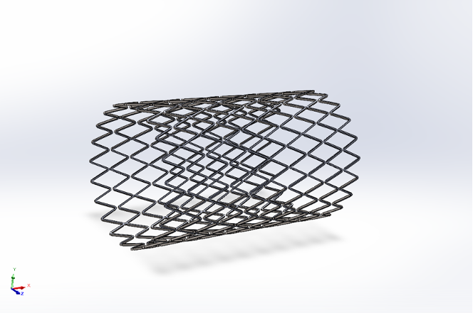
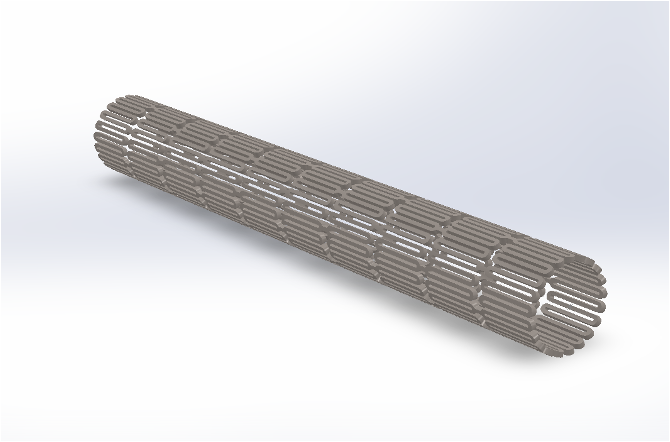
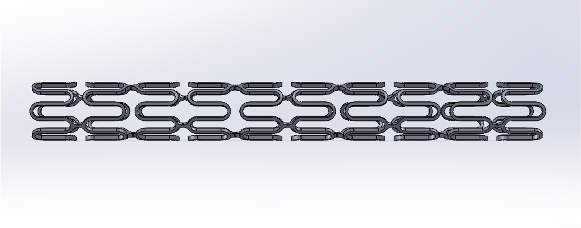
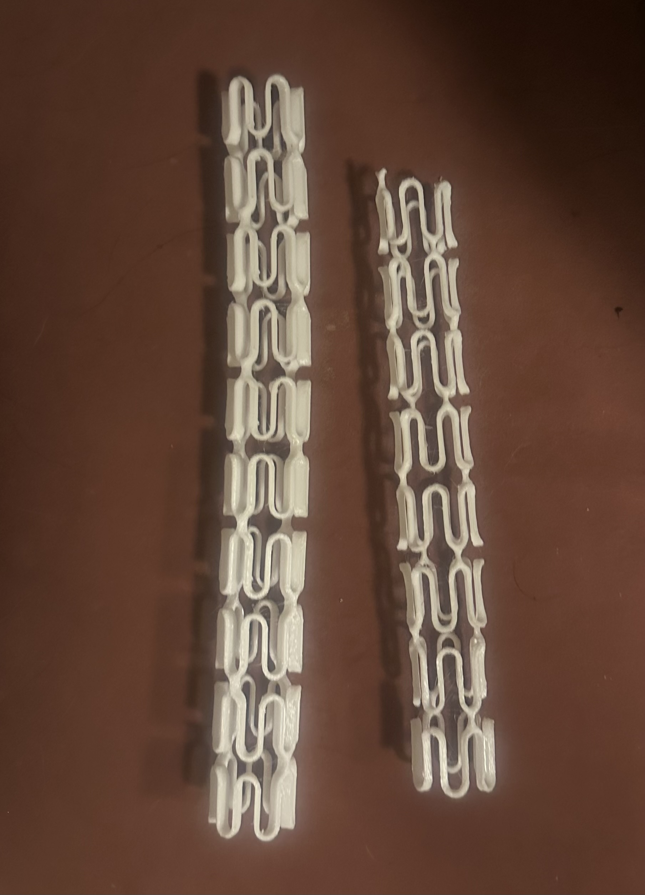

# Topology Optimization of Coronary Stents
> Computational design, finite element analysis, and topology optimization of next-generation coronary stent geometries using multiple materials.

<!-- Replace with a strong visual: e.g. a collage of your stent designs, stress contours, or the optimized geometry -->
## Stent Geometries

Three distinct parametric stent designs were developed in SolidWorks:

<table>
  <tr>
    <td align="center" width="33%">
       
      <b>Zig-Zag Geometry</b>
    </td>
    <td align="center" width="33%">
       
      <b>Staggered Slotted-Tube Geometry</b>
    </td>
    <td align="center" width="33%">
       
      <b>Hybrid Sinusoidal Geometry</b> 
      <i>(Selected for topology optimization)</i>
    </td>
  </tr>
</table>
## Key Results

- **50% material reduction** achieved on the PLA Hybrid stent using the SIMP topology optimization method, while maintaining the required radial support.
- Material was intelligently redistributed — removed from low-stress longitudinal connectors and concentrated in critical load-bearing regions (crowns and hinges).
- The optimized geometry was successfully reconstructed and smoothed in nTopology, producing a continuous, printable design suitable for additive manufacturing.
- Physical prototypes of both the original and optimized PLA stents were successfully 3D printed using FDM for direct comparison.

### Before vs After Topology Optimization

