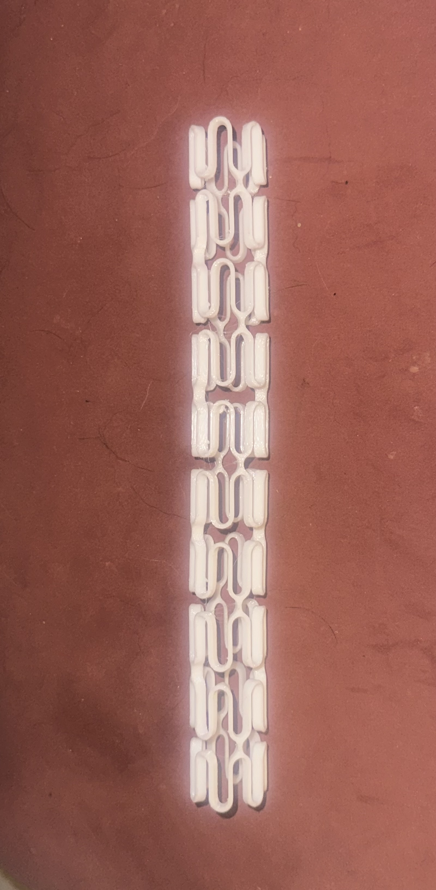
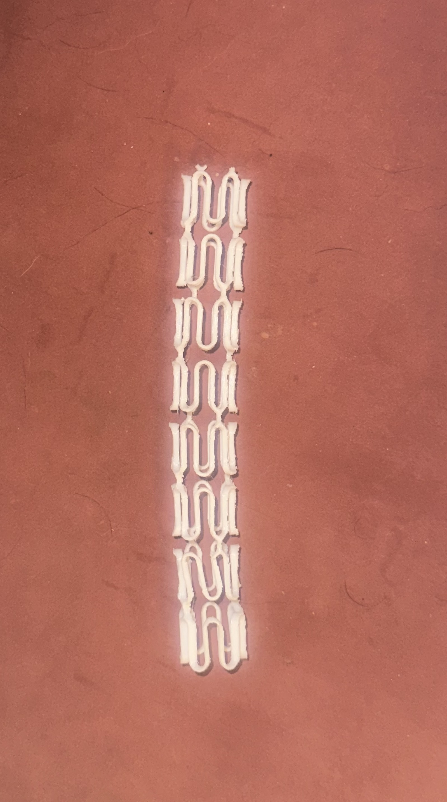

# Topology Optimization of Coronary Stents
> Computational design, finite element analysis, and topology optimization of next-generation coronary stent geometries using multiple materials.

<!-- Replace with a strong visual: e.g. a collage of your stent designs, stress contours, or the optimized geometry -->
## Stent Geometries

Three distinct parametric stent designs were developed in SolidWorks:

<table>
  <tr>
    <td align="center" width="33%">
       
      <b>Zig-Zag Geometry</b>
    </td>
    <td align="center" width="33%">
       
      <b>Staggered Slotted-Tube Geometry</b>
    </td>
    <td align="center" width="33%">
       
      <b>Hybrid Sinusoidal Geometry</b> 
      <i>(Selected for topology optimization)</i>
    </td>
  </tr>
</table>
## Key Results

- Achieved a **50% material reduction** on the PLA Hybrid stent using the SIMP topology optimization method while maintaining the required radial support.
- Material was intelligently redistributed — removed from low-stress longitudinal connectors and concentrated in critical load-bearing regions (crowns and hinges).
- The optimized geometry was successfully reconstructed and smoothed in nTopology, producing a continuous, printable design suitable for additive manufacturing.
- Physical prototypes of both the original and optimized PLA stents were successfully 3D printed using FDM for direct comparison.

### Original vs Optimized Stent (FDM Printed Prototypes)

<table>
  <tr>
    <td align="center" width="48%">
       
      <b>Original PLA Hybrid Stent</b> 
      <i>(Before Topology Optimization)</i>
    </td>
    <td align="center" width="48%">
       
      <b>Optimized PLA Hybrid Stent</b> 
      <i>(After Topology Optimization – 50% less material)</i>
    </td>
  </tr>
</table>

## Conclusions

- The Hybrid Alternating Sinusoidal geometry provided the best balance between flexibility and radial support across all tested materials.
- Topology optimization successfully reduced the PLA Hybrid stent volume by **50%** while maintaining structural integrity under 0.04 MPa loading.
- Material was redistributed from low-stress longitudinal connectors to critical crown and hinge regions, improving structural efficiency.
- The optimized geometry was reconstructed and smoothed in nTopology, resulting in a manufacturable design suitable for additive manufacturing.
- Physical FDM prototypes of both the original and optimized stents were successfully fabricated at macro scale for direct comparison.

## Future Work

- Perform **non-linear plasticity modeling** to better capture the behavior of PLA under larger deformations.
- Fabricate **true 1:1 scale prototypes** using high-resolution SLA resin printing instead of macro-scale FDM.
- Conduct **cyclic fatigue life testing** under physiological loading conditions to evaluate long-term durability.
- Perform hemodynamic (CFD) analysis on the optimized geometry to assess blood flow performance.
- Explore patient-specific customization using real vessel geometry.

  ## Approach

- **Phase 1**: Developed three parametric stent geometries in SolidWorks (Zig-Zag, Staggered Slotted-Tube, and Hybrid Sinusoidal).
- **Phase 2**: Performed static structural FEA in ANSYS on five biomaterials under 0.04 MPa hypertensive loading.
- **Phase 3**: Applied SIMP topology optimization on the PLA Hybrid model targeting 50% volume reduction.
- **Phase 4**: Reconstructed and smoothed the optimized geometry in nTopology for additive manufacturing compatibility.
- **Phase 5**: 3D printed physical prototypes (FDM) of both original and optimized designs at macro scale for comparison.
